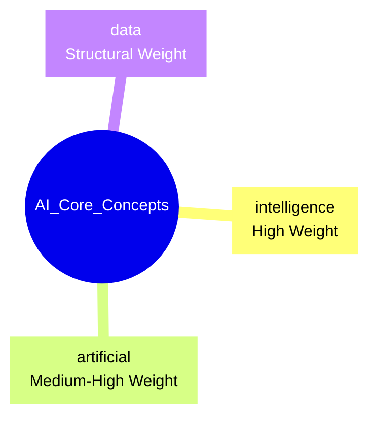

# Learning AI Core 

An ultra-fast, modern **C++23 Text-Mining & NLP Engine** built to reduce cognitive load and assist students with dyslexia (DSA). The engine extracts core concepts, computes information density, produces an explainable single-sentence summary, and exports Mermaid mind maps for instant visual overviews.

[](https://isocpp.org/std/the-standard) [](#license)

---

## Key Features

| Feature | Description |
|---|---|
| Document Parsing & Normalization | Zero-copy tokenization using `std::string_view` to avoid heap allocations; robust cleaning and token normalization. |
| Information Density Analyzer | Computes a numeric cognitive-load score for academic texts (example: ~79.5455%). |
| AI Smart Summary | Extracts the single most informative sentence using a tailored local TF‑IDF scoring algorithm; stop-words are excluded to avoid skewing. |
| Mermaid.js Visual Exporter | Generates Mermaid mind-map code that renders on GitHub and other Markdown viewers for quick visual summaries. |

---

## Live Mermaid Diagram

Paste this block into any GitHub Markdown file and GitHub will render it as a mindmap visualization:



---

## How to Build & Run

Requirements:
- CMake 3.25+ (or newer)
- A C++23-capable compiler (AppleClang, GCC 12+, or MSVC latest)

Build (out-of-source; recommended):

```bash
cmake -B "build" -S "."
cmake --build "build" --config Release
```

Run the binary (pass a `.txt` file as input):

```bash
./build/LearningAICore <path-to-input-file.txt>
```

Example (run on the included README for a quick smoke test):

```bash
cmake -B build -S .
cmake --build build
./build/LearningAICore README.md
```

---

## Expected Output (Terminal Sample)

Run the example pipeline and you should see output similar to the block below:

```
=========================================
=== RUNNING UPDATED C++23 NLP PIPELINE ===
=========================================

[ANALYSIS] Text Information Density: 79.5455%
[NOTICE] This text has high cognitive load (dense syntax).

=== AI SMART SUMMARY (Key Sentence) ===
>> Computer memory stores this data, but artificial intelligence learns patterns from the data itself.

[SUCCESS] Visual mind map generated successfully!
[INFO] File saved as: build/output_mindmap.md
```

---

## Project Directory Tree

```
.
├── CMakeLists.txt
├── README.md
├── include
│   ├── DocumentParser.hpp
│   ├── TextAnalyzer.hpp
│   └── ExportEngine.hpp
└── src
    ├── DocumentParser.cpp
    ├── TextAnalyzer.cpp
    ├── ExportEngine.cpp
    └── main.cpp
```

---

## Design & Implementation Notes

- Zero-copy and performance-first: the code favors `std::string_view` for tokenization and minimizes allocations. Strings are materialized only when ownership is required (e.g., keys in hash maps).
- Stop-words filtering: a constant, high-performance stop-word set prevents common filler words from affecting TF‑IDF math.
- Safety: file I/O is done via standard C++ streams with graceful error handling. No raw pointers; RAII used throughout.
- Extensibility: ExportEngine is designed to support multiple exporters (Mermaid, Graphviz, JSON) without touching core analyzers.

---

## Contributing

Contributions are welcome. Suggested workflow:

1. Fork the repository.
2. Create a feature branch: `git checkout -b feat/your-feature`
3. Add tests and documentation for the change.
4. Open a pull request describing the problem and your solution.

Please keep zero-copy principles in mind and prefer idiomatic modern C++ (C++23). Enable strict warnings in CI (`-Wall -Wextra -Werror`) to preserve code quality.

---

## License

This project is distributed under the MIT License. See the `LICENSE` file for details.

